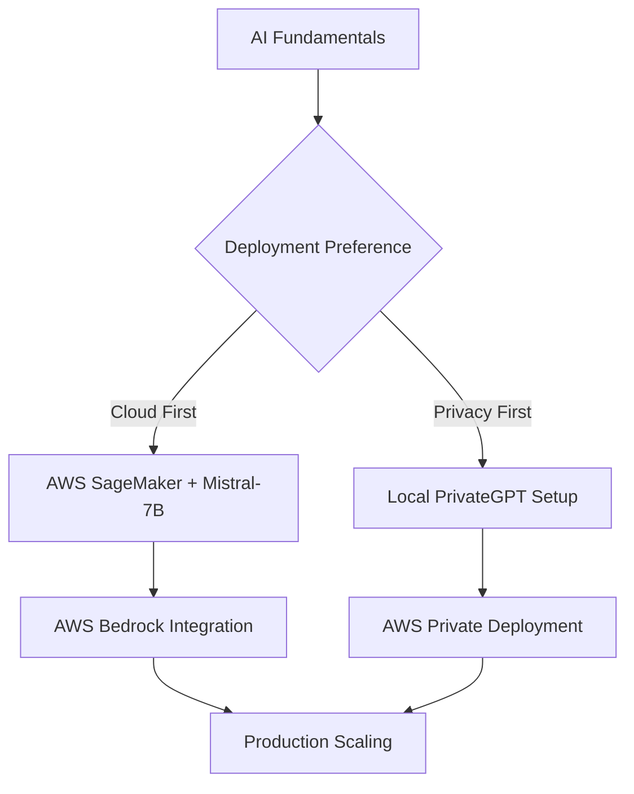

# AI & Machine Learning Projects Hub

Comprehensive collection of AI and machine learning implementation guides. From deploying large language models to building private AI infrastructure and leveraging cloud AI services.

## 🤖 Large Language Model Deployment

### Open Source LLM Implementation
Deploy and run state-of-the-art language models:

1. **[Deploy Mistral-7B with Ollama on AWS SageMaker](/docs/engineer/AI/Mistral-7B-SageMaker)** ⭐
   - Run Mistral-7B on powerful cloud infrastructure
   - Ollama integration for easy model management
   - Cost optimization and scaling strategies

2. **[Private AI with PrivateGPT Local Setup](/docs/engineer/AI/PrivateGPT)**
   - On-premises AI deployment for data privacy
   - Document processing and knowledge bases
   - Secure, offline AI capabilities

3. **[PrivateGPT on AWS Infrastructure](/docs/engineer/AI/PrivateGPTAWS)**
   - Cloud-based private AI deployment
   - AWS security and compliance considerations
   - Scalable private AI architecture

## ☁️ AWS AI Services Integration

### Production AI Deployment
Enterprise-grade AI service implementation:

4. **[Deploy Custom LLMs to AWS SageMaker](/docs/engineer/AI/DeployLLMToSageMaker)**
   - Production LLM deployment workflows
   - Model hosting and endpoint management
   - Auto-scaling and cost optimization

5. **[Amazon Bedrock with LangChain Workshop](/docs/engineer/AI/BedrockLangChainWorkshop1)**
   - Foundation model integration
   - LangChain framework implementation
   - Advanced prompt engineering techniques

6. **[AWS GenAI Ambassador Notes](/docs/engineer/AI/GenAIAmbassadorNotes)**
   - AWS generative AI services and capabilities
   - Real-world implementation insights
   - Service selection and architecture guidance

## 🔒 Private & Secure AI Infrastructure

### Data Privacy & Compliance
Build AI systems that prioritize privacy and control:

**Local Deployment Options**
- **[PrivateGPT](/docs/engineer/AI/PrivateGPT)**: Complete local AI setup for maximum privacy
- **[Ollama Integration](/docs/engineer/AI/Mistral-7B-SageMaker)**: Efficient local model management
- **Hardware Requirements**: GPU acceleration and memory considerations

**Cloud-Based Private AI**
- **[AWS Private Deployment](/docs/engineer/AI/PrivateGPTAWS)**: VPC isolation and security groups
- **Data Encryption**: At-rest and in-transit protection
- **Compliance**: GDPR, HIPAA, and SOC2 considerations

## 🚀 Getting Started Guide

### Recommended Learning Path

**Beginner Path**
1. Start with [Mistral-7B on SageMaker](/docs/engineer/AI/Mistral-7B-SageMaker) for hands-on LLM experience
2. Explore [AWS GenAI Services](/docs/engineer/AI/GenAIAmbassadorNotes) for production capabilities
3. Implement [Bedrock + LangChain](/docs/engineer/AI/BedrockLangChainWorkshop1) for advanced applications

**Privacy-Focused Path**
1. Begin with [Local PrivateGPT](/docs/engineer/AI/PrivateGPT) setup
2. Scale to [AWS Private Deployment](/docs/engineer/AI/PrivateGPTAWS)
3. Integrate with existing infrastructure

## 🎯 Project Categories

### By Use Case

**Document Processing & RAG**
- Knowledge base creation and querying
- Document analysis and summarization
- Intelligent search and retrieval

**Conversational AI**
- Chatbot development and deployment
- Customer service automation
- Interactive AI assistants

**Content Generation**
- Automated content creation
- Code generation and review
- Creative writing assistance

### By Infrastructure Type

**Cloud-Native AI**
- AWS SageMaker deployments
- Bedrock foundation models
- Serverless AI architectures

**Hybrid Deployments**
- Private cloud integration
- Edge AI capabilities
- Multi-cloud strategies

**On-Premises AI**
- Local LLM hosting
- Air-gapped environments
- Regulatory compliance setups

## 🔧 Development Tools & Frameworks

### Essential Technologies

**Model Deployment**
- **Ollama**: Local model management and serving
- **AWS SageMaker**: Production model hosting
- **Docker**: Containerized AI applications

**Development Frameworks**
- **LangChain**: AI application development
- **Hugging Face**: Model hub and transformers
- **FastAPI**: AI service APIs

**Monitoring & Operations**
- **MLflow**: Experiment tracking and model registry
- **AWS CloudWatch**: Performance monitoring
- **Grafana**: Custom AI metrics dashboards

## 💰 Cost Optimization Strategies

### Cloud AI Economics
- **SageMaker Cost Management**: Instance types and auto-scaling
- **Bedrock Pricing**: Token usage optimization
- **Spot Instances**: Cost-effective training and inference

### Local Deployment ROI
- **Hardware Investment**: GPU requirements vs. cloud costs
- **Energy Consumption**: Power efficiency considerations
- **Maintenance Overhead**: Support and updates

## 🔗 Related Engineering Topics

**Infrastructure & DevOps**
- [Proxmox Virtualization Hub](/docs/engineer/LAB/proxmox-hub) - AI infrastructure hosting
- [Kubernetes Deployment](/docs/engineer/K8s/) - Container orchestration for AI

**Cloud Platforms**
- [AWS Services](/docs/engineer/AWS/) - Cloud AI infrastructure
- [Azure AI](/docs/engineer/Azure/) - Microsoft AI services
- [GCP AI](/docs/engineer/GCP/) - Google Cloud AI platform

**Security & Compliance**
- [Infrastructure Security](/docs/hacker/) - AI system security
- [Data Privacy](/docs/engineer/Misc/) - Compliance and governance

---

🤖 **Join the AI Revolution**: Start with any project above and build your expertise in modern AI infrastructure and deployment.