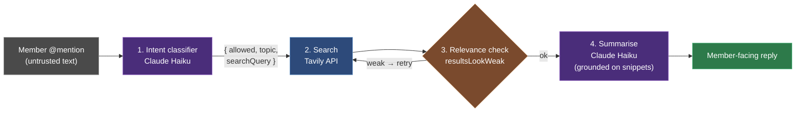
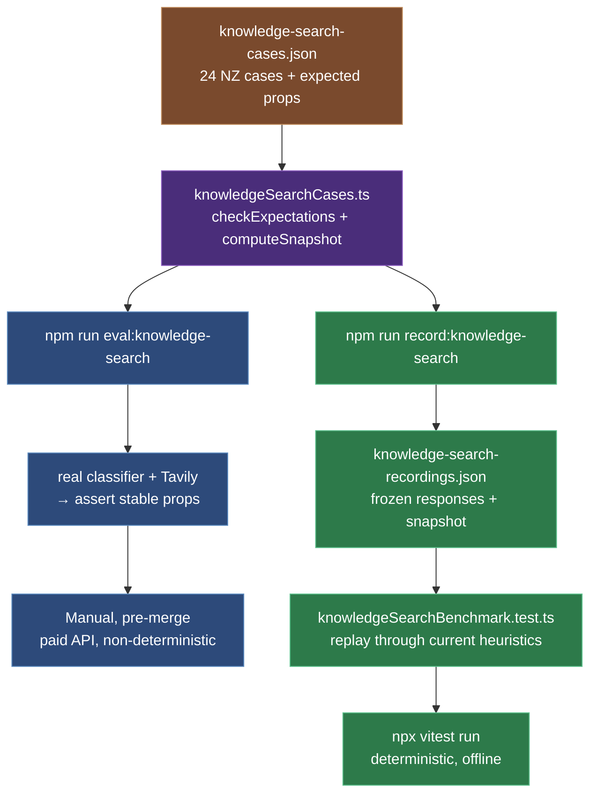

:::info 🤖 AI Collaboration
This post was co-written with AI assistance. All technical testing, troubleshooting, and real-world insights are from the author's direct experience. AI helped with structure, clarity, and documentation formatting.
:::

## Overview

GLXTCH is a Discord bot for a primarily New Zealand tech community. One of its features lets senior members `@`-mention the bot to research an external topic — a news story, a definition, a current event — and get back a short, bot-voiced summary. Under the hood it runs a web search via the [Tavily](https://tavily.com) API and then summarises the results with a Claude Haiku model on Amazon Bedrock.

The feature worked, but the results were repeatedly bad for exactly the kind of query it exists to answer. Asking *"Why is Dave Letele in trouble in the news?"* — Dave Letele being a well-known New Zealand boxer-turned-social-advocate — returned noise, and the summary faithfully described that noise. It happened more than once.

This is a write-up of what the pipeline actually does, why the results were wrong, the fix across three layers, and the evaluation harness now standing guard so it doesn't regress.

:::tip The short version
**Tavily was never the problem** — it returns excellent New Zealand results when asked correctly. The failures were upstream, in how the query was constructed and how the results were judged.
:::

---

## Background: what the pipeline does

Understanding the failure needs the shape of the pipeline. A senior `@`-mention flows through four stages:

1. **Intent gate (Claude Haiku).** The raw member message is untrusted, so a classifier decides whether it's a legitimate research request at all, and if so emits a *web-search-optimised* query string. Its output is JSON: `{ allowed, topic, searchQuery }`. `topic` is `news` or `general`; `searchQuery` is a keyword string, not the member's full sentence.

2. **Search (Tavily).** The `searchQuery` is sent to Tavily's `/search` endpoint. Tavily is a search API built for LLM pipelines — you give it a query and options, it returns ranked results with title, URL, and a content snippet already extracted from each page. The options that matter here:
   - `topic: news` with `time_range: week` for current-events queries,
   - `include_domains` to restrict results to a set of sites (e.g. NZ news outlets),
   - `search_depth: basic | advanced`,
   - `country` to bias ranking.

3. **Relevance check + retry.** The bot doesn't trust the first result set blindly. A set of heuristics (`resultsLookWeak`) decides whether the results look on-topic and geographically right. If they look weak, it retries with a different query/option combination — for example, wrapping the entity in quotes and pinning `include_domains` to NZ news sites. It keeps the best set it saw.

4. **Summarise (Claude Haiku).** The winning results are handed to a second Haiku call that writes the member-facing reply in the bot's voice. Critically, this call is **grounded only on the Tavily snippets** — it's instructed to state facts supported by the search results and nothing else.



That last point is the whole reason bad search is so damaging. The summariser is doing its job correctly: it summarises what it's given. If stage 2 hands it articles about the Golden State Warriors, it will write an accurate, well-voiced summary about the wrong Warriors.

:::warning Garbage in, garbage out — and the garbage looks polished on the way out
A grounded summariser faithfully reflects whatever retrieval hands it. Bad search doesn't produce an obviously broken reply; it produces a confident, well-voiced, *wrong* one. That's why the symptom presented as "the summary is bad" when the actual fault was two stages upstream.
:::

---

## The symptom

Two queries reproduced it reliably:

- *"Why is Dave Letele in trouble in the news?"* → results drifted toward unrelated US "Dave" figures instead of the NZ story (Letele taking over the embattled supplement retailer NZ Muscle).
- *"Why are the Warriors in the news?"* → results were the **Golden State Warriors** (NBA, LeBron James trade rumours), not the **NZ Warriors** (NRL rugby league).

And they passed the bot's own relevance check as "clean" — so no retry fired, and the wrong results went straight to the summariser.

---

## Investigation

Guessing at an LLM pipeline is a waste of time; the fix has to be measured. So the first step was a throwaway harness that ran the **real** pipeline — real classifier, real Tavily — over a batch of queries and printed, per query: the classifier's `searchQuery`, whether it anchored New Zealand, how many results came from NZ domains, and the `resultsLookWeak` verdict.

The query set was deliberately weighted toward the danger zone: **NZ entities that share a name with a better-known foreign entity.** New Zealand sport is full of them:

| NZ entity | Foreign namesake |
|---|---|
| Warriors (NRL) | Golden State Warriors (NBA) |
| Chiefs (Super Rugby) | Kansas City Chiefs (NFL) |
| Hurricanes (Super Rugby) | Carolina Hurricanes (NHL) |
| Phoenix (Wellington Phoenix, football) | Phoenix Suns (NBA) |

Plus common-word NZ brands (Spark, Contact, Vector), NZ public figures, and a control group of unambiguously-NZ entities (All Blacks, Silver Ferns) that should always pass.

:::note The one metric that cracked it: SUSPECT
The harness added a single boolean detector for the precise failure mode — a `news` query that passed the relevance check as "clean" but returned **zero** NZ-domain results. That's a wrong-country result sailing through undetected. This one flag turned a vague "results are bad sometimes" into "2 of 20, here they are."
:::

The first run over 20 queries was blunt about it:

- **SUSPECT (wrong country, passed as clean): 2** — Warriors, Chiefs.
- **Classifier dropped the NZ anchor entirely: 7/20 (35%).**
- **Legit queries rejected outright: 3** — "what's going on with Spark?", "…with Contact?", "…with the Phoenix?" were refused by the classifier as if they were questions about the Discord server.

That was enough to locate the fault in two layers, not one.

---

## Root cause

### Layer 1 — the intent classifier under-specified the query

The classifier is what turns *"Why are the Warriors in the news?"* into a search string. It was emitting `"Warriors news"` — no country, no sport. Tavily, given a bare ambiguous word, quite reasonably returned the globally-dominant Warriors. In the Chiefs case it even added `"rugby"` but still no country, and Tavily returned the NFL anyway.

:::info The disambiguator is the attribute the model drops
For a name that collides with a foreign entity, **the sport isn't enough — the country is the disambiguator.** The classifier was omitting it 35% of the time. When a model produces an ambiguous query, look for the *one* attribute that would resolve the collision — it's usually the one being left out.
:::

It was also *over-rejecting*. A bare common word like "Spark" or "Contact" was being treated as a possible server question and refused, so a senior asking about the NZ telco just got silently ignored — arguably worse than a bad answer.

### Layer 2 — the relevance heuristics couldn't catch it

Two separate bugs meant a wrong result set wasn't flagged for retry:

**Glued distinctive terms.** The relevance check extracts "distinctive terms" it expects to see in on-topic results (proper nouns, brand names) and flags the set as weak if none appear. But the extractor greedily matched the *entire* run of Title-Case words as one term. Once the classifier fix started appending "New Zealand" to every query, this got worse: `"Hurricanes Super Rugby New Zealand"` became a single term that never appears verbatim in any article — so a result set that *did* contain "Hurricanes" was flagged as missing the entity. False negatives in both directions.

**`.co.nz`-only NZ detection.** The "are these results actually from New Zealand?" check tested for the `.co.nz` domain suffix only. That silently excludes `.govt.nz`, `.ac.nz`, `.org.nz`, and `newzealand.com` — so a perfectly good result set from `teara.govt.nz` (the government's encyclopedia of NZ) was judged "geographically wrong."

Neither heuristic could catch the Warriors case anyway: `"Warriors news"` had no NZ mention and no multi-word proper noun, so the relevance check had nothing to grab onto and defaulted to "clean." **The relevance signal collapsed to nothing precisely for single-word entities — the ones most likely to collide.**

---

## The fix

Three changes, in the order of leverage the data showed.

### 1. Classifier prompt — always anchor NZ, disambiguate collisions, stop over-rejecting

The classifier prompt (`bot/src/services/knowledgeIntent.ts`) got explicit instructions plus few-shot examples for the collision cases:

- Always include "New Zealand" in the `searchQuery` unless the topic is unmistakably international.
- Disambiguate names that collide with foreign entities — spelled out for NZ sports teams (Warriors → `NZ Warriors NRL`, Chiefs → `Waikato Chiefs Super Rugby`, Phoenix → `Wellington Phoenix football`).
- Explicitly allow single common-word entities (Spark, Contact, Phoenix) as valid research topics, not server questions.

This is the highest-leverage change — it fixes the query at the source, before Tavily ever sees it.

### 2. Distinctive-term extraction — keep the entity, drop the tail

`extractDistinctiveTerms` (`bot/src/services/knowledgeSearch.ts`) now trims a Title-Case run at the first generic "tail" word (league/topic/geo/corporate suffixes) and keeps only the leading proper-noun run:

```ts
const ENTITY_TAIL_WORDS = new Set([
  'new', 'zealand', 'nz', 'news', 'latest', 'super', 'rugby', 'league',
  'netball', 'football', 'basketball', /* … */ 'company', 'group',
]);

function trimEntityTail(phrase: string): string {
  const kept: string[] = [];
  for (const word of phrase.split(/\s+/)) {
    if (ENTITY_TAIL_WORDS.has(word)) break;
    kept.push(word);
  }
  return kept.join(' ');
}
```

So `"Hurricanes Super Rugby New Zealand"` → `"hurricanes"`, which actually matches article text. The junk-anchor stoplist was also expanded (`why`, `are`, `been`, `doing`, …) to stop garbage like `"why are"` becoming a search anchor.

### 3. NZ detection — the whole `.nz` TLD, not just `.co.nz`

```ts
const NZ_RESULT_URL = /\.nz\b|(?:^|\.)newzealand\.com\b/i;

export function isNzResult(result: TavilySearchResult): boolean {
  return NZ_RESULT_URL.test(result.url);
}
```

Now `.govt.nz`, `.ac.nz`, `.org.nz` and `newzealand.com` all count as NZ.

### Result

Re-running the harness over the same 24 NZ queries after all three fixes:

| Metric | Before | After |
|---|---|---|
| Wrong-country passes as clean | 2 | **0** |
| Classifier dropped NZ anchor | 7 | **0** |
| Legit queries rejected | 3 | **0** |
| False-WEAK (glue / `.co.nz`-only) | 5 | **0** |

`"Why is Dave Letele in trouble in the news?"` now returns eight NZ results — NZ Herald, RNZ, Stuff — on the first attempt.

The Warriors case makes the two-layer failure — and its fix — concrete:

```mermaid
graph TD
    subgraph Before["Before"]
        Q1["'why are the Warriors<br/>in the news?'"] --> SQ1["searchQuery:<br/>'Warriors news'"]
        SQ1 --> RES1["Golden State Warriors<br/>(NBA) — wrong country"]
        RES1 --> CHK1{"relevance check"}
        CHK1 -->|"no NZ mention,<br/>no distinctive term"| PASS1["passes as 'clean' ❌<br/>no retry fires"]
    end
    subgraph After["After"]
        Q2["'why are the Warriors<br/>in the news?'"] --> SQ2["searchQuery:<br/>'NZ Warriors NRL<br/>New Zealand news'"]
        SQ2 --> RES2["NZ Warriors (NRL)<br/>RNZ, NZ Herald"]
        RES2 --> CHK2{"relevance check"}
        CHK2 -->|"NZ result +<br/>entity present"| PASS2["clean ✅"]
    end

    style Q1 fill:#4a4a4a,stroke:#888,color:#fff
    style SQ1 fill:#7a2d2d,stroke:#bf5b5b,color:#fff
    style RES1 fill:#7a2d2d,stroke:#bf5b5b,color:#fff
    style PASS1 fill:#7a2d2d,stroke:#bf5b5b,color:#fff
    style CHK1 fill:#4a4a4a,stroke:#888,color:#ccc
    style Q2 fill:#4a4a4a,stroke:#888,color:#fff
    style SQ2 fill:#2d7a4a,stroke:#5bbf8b,color:#fff
    style RES2 fill:#2d7a4a,stroke:#5bbf8b,color:#fff
    style PASS2 fill:#2d7a4a,stroke:#5bbf8b,color:#fff
    style CHK2 fill:#4a4a4a,stroke:#888,color:#ccc
```



---

## The eval — how it's used now and against future changes

The throwaway harness proved its worth, so it was promoted into a permanent, two-form benchmark. The design point: a search pipeline like this has **two very different things to test**, and they need different tools.

- **Live quality** (does it work against the real world *today*?) is non-deterministic — news changes, so "is there Chiefs news this week" flaps. It can't be a CI gate.
- **Heuristic regression** (did my code change alter a verdict?) *must* be deterministic and free, so it can live in the normal test suite and eventually gate CI.

So there's one shared case corpus feeding two runners.



### The shared corpus

`bot/fixtures/knowledge-search-cases.json` — 24 NZ cases, each tagged `collision` / `control` / `concept`, each with an `expect` block of **stable structural properties** (never freshness):

```json
{
  "id": "warriors-nrl",
  "group": "collision",
  "memberQuery": "why are the Warriors in the news?",
  "expect": { "allowed": true, "topic": "news", "nzAnchored": true, "notWrongCountry": true }
}
```

The assertion logic (`checkExpectations`) and the heuristic verdict (`computeSnapshot`) live in one module — `bot/src/services/knowledgeSearchCases.ts` — so both runners agree on what "pass" means.

### Form 1 — live benchmark (manual, pre-merge)

```bash
AWS_PROFILE=<your-profile> npm run eval:knowledge-search
```

Runs the real classifier + real Tavily for all 24 cases and asserts the stable properties: was it allowed, did the query anchor NZ, did at least one NZ result come back, is the topic right. It hits a paid API and depends on live news, so it's a **human gate before merging** a search/classifier change — not CI. Current state: 24/24 pass.

### Form 2 — deterministic benchmark (offline, test-suite)

Real API calls can't run in CI, so the current responses are **recorded once** into a fixture:

```bash
AWS_PROFILE=<your-profile> npm run record:knowledge-search
# writes bot/fixtures/knowledge-search-recordings.json
```

Each record freezes the classifier output, the Tavily results, *and* a heuristic **snapshot** (`weak` / `nzResultCount` / `entityInResults`) computed at record time. Then a vitest (`knowledgeSearchBenchmark.test.ts`) replays those frozen results through the **current** heuristics and asserts two things per case:

1. the recorded response still satisfies the case's stable expectations, and
2. today's heuristics produce the **same snapshot** they did at record time.

Assertion 2 is the regression net. If someone later tweaks `extractDistinctiveTerms`, `isNzResult`, or `resultsLookWeak` in a way that flips a verdict — say, Hurricanes back to a false-WEAK — this test fails with the exact case named. It runs offline and for free as part of the normal `npx vitest run` suite (currently 468 tests green, 49 of them this benchmark).

:::warning CI-ready, not yet CI-gated
The bot's CI job currently only builds (`npm ci` + `npm run build`) — it does not run the test suite. So this benchmark is *CI-ready* but not yet CI-*gated*; today it only fires when someone runs vitest locally. Wiring a `npm test` step into the CI workflow is the obvious next step to make the regression net automatic.
:::

### The workflow for future changes

1. Change a heuristic or the classifier.
2. Run `npx vitest run` — if the deterministic benchmark fails, a verdict moved. Read *which* case and decide: bug, or intended?
3. If intended, run `npm run record:knowledge-search` to re-freeze the recordings, and commit the updated fixture alongside the code.
4. Before merging anything that touches search or the classifier, run `npm run eval:knowledge-search` once to confirm live quality still holds.

The corpus is also the place to encode any *new* failure the bot hits in the wild: add the query as a case, watch it fail, fix, watch it pass. The benchmark grows with every real-world miss.

---

## Lessons

- **In a search → summarise pipeline, a polished summary is not evidence of a correct answer.** The summariser is grounded on the search results; bad retrieval produces confident, well-written, wrong output. Debug the retrieval, not the prose.
- **The disambiguator for a name collision is usually the attribute the model drops.** Here it was the country. The sport wasn't enough; "New Zealand" was.
- **A relevance heuristic that keys on one narrow signal (`.co.nz`) fails silently on everything outside it.** Broadening to the whole `.nz` TLD removed a class of false negatives in one line.
- **Diagnose LLM pipelines with a harness, not intuition.** The single most useful artifact was the SUSPECT metric — one boolean that turned a vague "results are bad sometimes" into "2 of 20, here they are."
- **Split your evals by determinism.** Live quality and heuristic regression are different questions; forcing them into one runner gives you either a flaky CI gate or no CI coverage at all.
