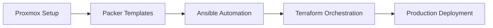

# Proxmox Virtualization Hub

Complete collection of Proxmox guides for building and managing virtualized infrastructure. From basic VM management to advanced automation with Infrastructure as Code (IaC) tools.

## 🚀 Getting Started with Proxmox Automation

### Infrastructure as Code (IaC) Workflow
Build automated VM provisioning pipelines using industry-standard tools:

1. **[Create Cloud-Init VM Templates with Packer](./proxmox-packer-vm)** ⭐
   - Automate VM template creation with Packer
   - Cloud-init configuration and troubleshooting
   - Foundation for scalable infrastructure

2. **[Automate VM Deployment with Ansible](./proxmox-cloudinit)** ⭐
   - Ansible playbook automation for Proxmox
   - API token configuration and permissions
   - Mass VM deployment workflows

3. **[Terraform Infrastructure Provisioning](./proxmox-terraform)**
   - Declarative infrastructure management
   - Multi-VM cluster deployments
   - State management best practices

## 🔧 Advanced Management & Troubleshooting

### System Administration
Expert-level Proxmox management techniques:

4. **[Mount VM Logical Volumes for Direct Access](./proxmox-lvm-mount)** ⭐
   - Direct filesystem access for troubleshooting
   - LVM volume mounting procedures
   - VM recovery and debugging techniques

5. **[Proxmox System Administration Guide](./proxmox-sysad)**
   - Advanced configuration and optimization
   - Performance tuning and monitoring
   - Security hardening practices

## 📋 Complete Automation Workflow

### Recommended Implementation Path

For new Proxmox deployments, follow this progression:

1. **Template Creation**: Start with [Packer VM templates](./proxmox-packer-vm) for consistent base images
2. **Automation Layer**: Implement [Ansible playbooks](./proxmox-cloudinit) for VM lifecycle management
3. **Infrastructure Orchestration**: Use [Terraform](./proxmox-terraform) for declarative infrastructure
4. **Troubleshooting Skills**: Master [LVM mounting](./proxmox-lvm-mount) for system recovery

## 🎯 Use Cases & Applications

### Home Lab Infrastructure
- **Development Environments**: Rapid dev/test VM provisioning
- **Kubernetes Clusters**: Automated multi-node cluster deployment
- **CI/CD Pipelines**: Infrastructure testing and validation
- **Learning Platform**: Safe environment for experimentation

### Production Considerations
- **Backup Strategies**: VM snapshot and backup automation
- **High Availability**: Cluster configuration and failover
- **Monitoring**: Performance metrics and alerting
- **Security**: Network isolation and access controls

## 🔗 Related Infrastructure Guides

**Networking & DNS**
- [Pi-hole with Unbound DNS Setup](./pihole-docker-unbound) - Privacy-focused DNS for your infrastructure

**Container Orchestration**
- [Kubernetes Deployment Guides](/docs/engineer/K8s/) - Container orchestration on Proxmox VMs

**Cloud Integration**
- [AWS Infrastructure Guides](/docs/engineer/AWS/) - Hybrid cloud architectures

## 💡 Quick Tips

**Performance Optimization**
- Use virtio drivers for better VM performance
- Configure CPU and memory overcommitment based on workload
- Implement SSD caching for improved I/O performance

**Automation Best Practices**
- Version control all IaC configurations
- Implement proper secret management for API tokens
- Use infrastructure testing frameworks for validation

**Troubleshooting Resources**
- [LVM volume mounting](./proxmox-lvm-mount) for direct filesystem access
- Proxmox logs: `/var/log/pve/` and `/var/log/syslog`
- API debugging with curl and Postman

---

💬 **Need Help?** Join the discussion in our community forums or check the official [Proxmox Documentation](https://pve.proxmox.com/pve-docs/).