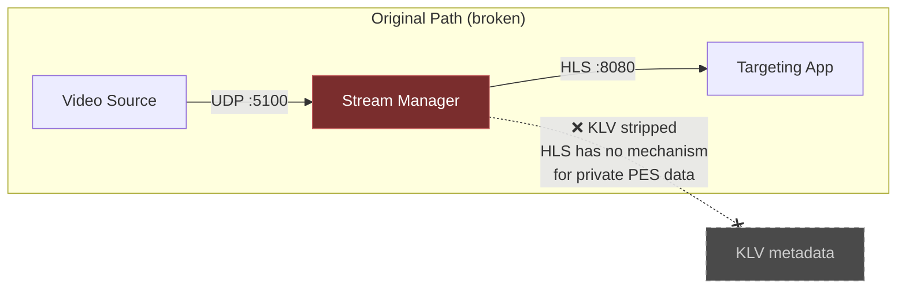
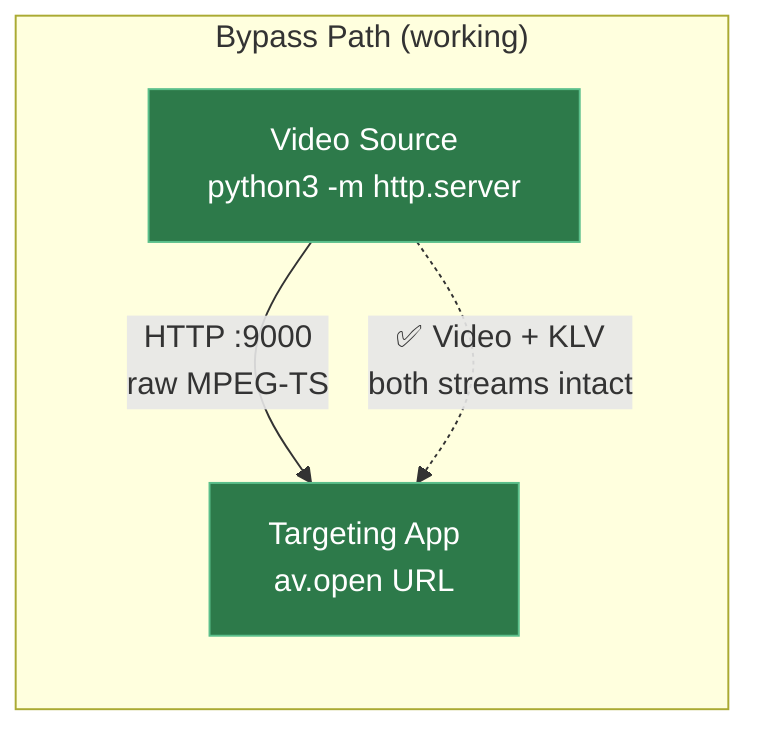
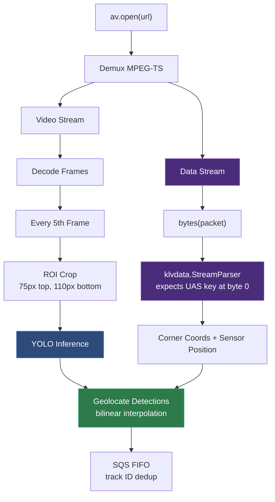
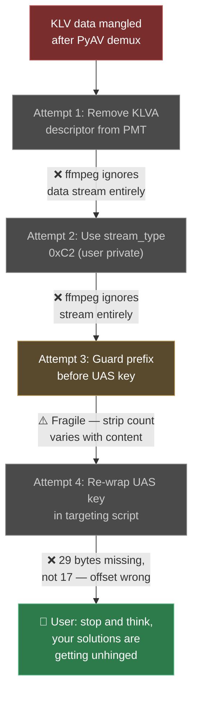
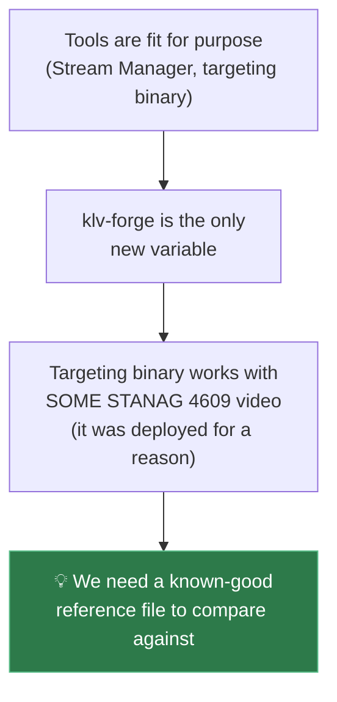
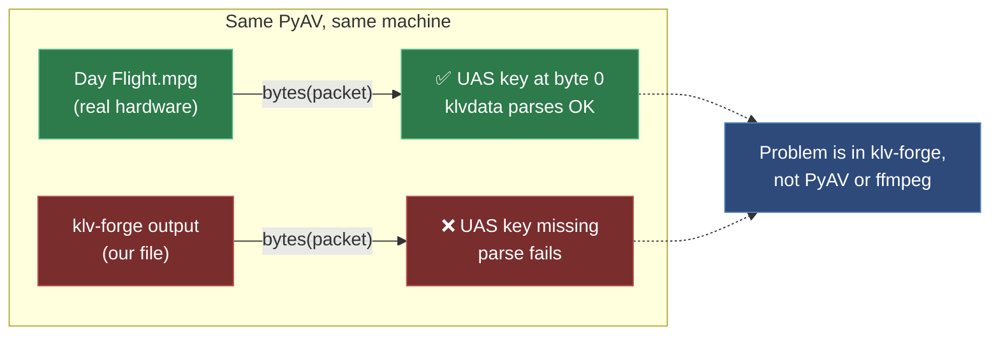
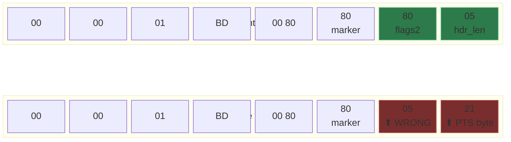
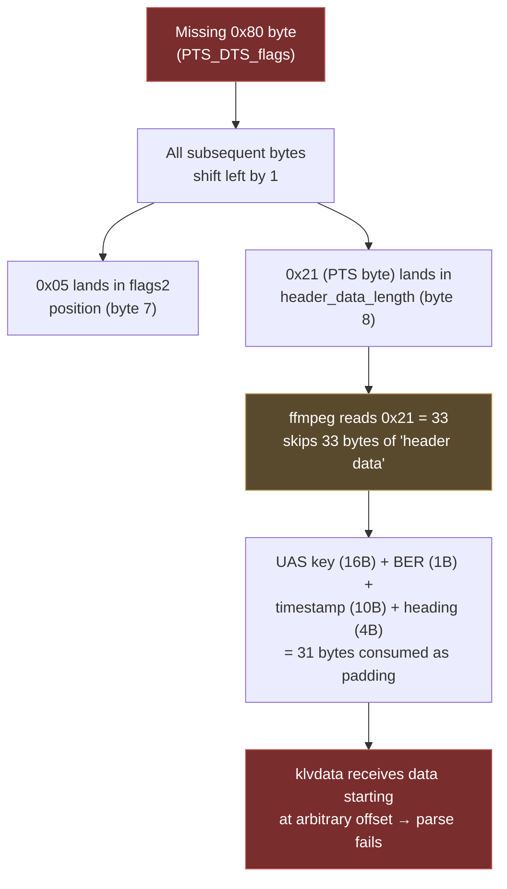
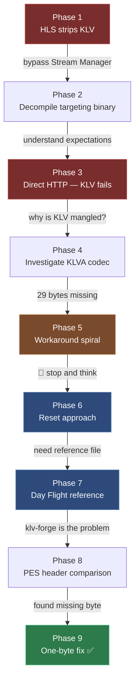

Kiro and I were building a compliant STANAG 4609 stream for a TAK Server stack — drone video with MISB ST 0601 KLV metadata so the targeting application could get image recognition and GPS coordinates in a single stream. Somewhere in the pipeline, something was stripping the KLV metadata from the MPEG-TS.

This is the documented journey of troubleshooting that issue down to the root cause, and how we found it (eventually).

## Context

The TAKDemo pipeline processes drone video with MISB ST 0601 KLV metadata:


The targeting binary (PyInstaller-packaged Python) uses PyAV to demux MPEG-TS, klvdata to parse KLV metadata, and YOLO to detect objects. It geolocates detections using corner coordinates from the KLV and sends them to SQS FIFO.

No STANAG 4609 test video existed. klv-forge was built to generate one.

---

## Phase 1: Stream Manager Strips KLV

**Symptom**: Targeting app gets video but no metadata.

The original architecture routes video through the Stream Manager, which converts MPEG-TS to HLS for delivery:



**Finding**: ffprobe on the HLS segments showed zero data streams. HLS does not support MPEG-TS private data PES streams — the Stream Manager strips KLV during the MPEG-TS → HLS → MPEG-TS conversion. This is by design; HLS has no mechanism for carrying KLV.

**Decision**: Bypass Stream Manager entirely. Serve raw MPEG-TS over HTTP so both video and KLV streams reach the targeting app intact.



---

## Phase 2: Decompiling the Targeting Binary

To understand exactly what the targeting app expects, we decompiled the PyInstaller binary using pyinstxtractor + pycdc. Key findings:



- Uses `av.open(url)` to demux — handles any format ffmpeg supports
- Requires both `video` and `data` streams (raises exception if either missing)
- Uses `klvdata.StreamParser(bytes(packet))` — expects UAS universal key at byte 0
- Runs YOLO every 5th frame with ROI cropping (75px top, 110px bottom)
- Geolocates via bilinear interpolation from MISB corner coordinates
- Sends to SQS FIFO with track ID deduplication

Source saved to `TAKDemo/output/targeting_reconstructed.py`.

**Decompilation artifact found later**: pycdc produced `frame.shape[75:2]` instead of `frame.shape[:2]` — a slice starting at index 75 returns an empty tuple, causing `ValueError: not enough values to unpack`. Fixed to `frame.shape[:2]`.

---

## Phase 3: Direct HTTP — Video Works, KLV Fails

With the Stream Manager bypassed, the targeting app successfully opened the MPEG-TS stream and decoded video frames. But KLV parsing failed:

```text
data stream
Failed to parse KLV packet: cannot fit 'int' into an index-sized integer
frame
```

The `data stream` log confirmed PyAV was delivering data packets. But `klvdata.StreamParser` couldn't parse them. The `bytes(packet)` call returned data, but it didn't start with the UAS universal key.

---

## Phase 4: Investigating ffmpeg's KLVA Codec

**Hypothesis**: ffmpeg's KLVA codec is stripping data from KLV packets.

When PyAV demuxes an MPEG-TS with a KLVA registration descriptor in the PMT, ffmpeg assigns `AV_CODEC_ID_SMPTE_KLV` to the data stream. The KLVA codec strips the UAS universal key (16 bytes) and BER length encoding from each packet before delivering the payload.

We confirmed this by hex-dumping `bytes(packet)` output — the UAS key was missing. The data started at what should have been the first tag after the BER length.

**But it was worse than expected**: not just 17 bytes (16-byte key + 1-byte BER) were missing. Debug logging showed 29 bytes stripped — the UAS key, BER length, timestamp tag (tag 2, 10 bytes), and heading tag (tag 5, 4 bytes) were all gone.

---

## Phase 5: Attempted Workarounds (The Spiral)

This phase involved several increasingly creative attempts to work around the stripping behaviour. None worked reliably.



**Attempt 1: Remove KLVA descriptor from PMT**
Idea: without the registration descriptor, ffmpeg won't detect KLVA and won't strip anything. Result: ffmpeg also didn't create a data stream at all. The targeting app raised "No video stream found" (its error message for missing streams).

**Attempt 2: Use stream_type 0xC2 (user private)**
Idea: a non-standard stream type might bypass KLVA detection. Result: ffmpeg ignored the stream entirely.

**Attempt 3: Guard prefix before UAS key**
Idea: prepend sacrificial bytes that ffmpeg strips instead of the real data. Result: partially worked in isolation but tightly coupled to ffmpeg's internal stripping logic. The number of bytes stripped varied depending on the content, making this fragile.

**Attempt 4: Re-wrap UAS key in targeting script**
Idea: since ffmpeg strips the key, re-add it in `extract_klv_data()` before passing to klvdata. Result: still got `cannot fit 'int' into an index-sized integer` because the stripping wasn't a clean 17 bytes — it was 29 bytes, and the remaining data started at an arbitrary offset within the KLV payload.

**User intervention**: *"Stop and think. Your solutions are getting unhinged."*

This was the right call. We were treating symptoms instead of finding the root cause.

---

## Phase 6: Stepping Back — What Do We Actually Know?

After the reset, we discussed the situation without writing code:

1. The tools (Stream Manager, targeting binary) are supposedly fit for purpose
2. klv-forge is the only new variable — it needs to conform to everything else
3. The targeting binary works with *some* STANAG 4609 video (it was deployed for a reason)
4. We need a known-good reference file to compare against

**Key insight from the user**: *"We really need a valid STANAG 4609 video."*



---

## Phase 7: Finding the Day Flight Reference

The klvdata library's README links to ffmpeg's sample repository. We found:

```text
http://samples.ffmpeg.org/MPEG2/mpegts-klv/Day%20Flight.mpg
```

A real STANAG 4609 file with MISB 0601 KLV metadata, recorded from actual flight hardware.

Downloaded it to the targeting instance and tested with the same PyAV code:

```python
container = av.open('Day Flight.mpg')
for packet in container.demux():
    if packet.stream.type == 'data':
        raw = bytes(packet)
        print(raw[:20].hex())
```

**Result**: The Day Flight file delivered KLV packets with the UAS universal key intact at byte 0. `klvdata.StreamParser` parsed them perfectly.

Same PyAV version. Same machine. Same code. Different file. Different result.



This meant the problem was definitively in klv-forge's output, not in PyAV or ffmpeg's KLVA codec behaviour.

---

## Phase 8: Byte-Level PES Header Comparison

We wrote comparison scripts to examine the raw MPEG-TS structure of both files. The critical difference was in the PES packet headers.



In the broken version, byte 7 has `0x05` (which should be `PES_header_data_length` at byte 8), and byte 8 has `0x21` (first PTS byte, decimal 33) which ffmpeg reads as "skip 33 bytes of header data" — consuming the KLV payload.

**Day Flight PES header** (correct):
```text
00 00 01 BD  — PES start code + stream_id (private_stream_1)
00 80        — PES packet length
80           — byte 6: marker bits '10'
80           — byte 7: PTS_DTS_flags = '10' (PTS only)
05           — byte 8: PES_header_data_length = 5
21 xx xx xx xx — PTS (5 bytes)
06 0E 2B ... — KLV payload starts here (UAS key)
```

**klv-forge PES header** (broken):
```text
00 00 01 BD  — PES start code + stream_id
00 80        — PES packet length
80           — byte 6: marker bits '10'
05           — byte 7: ← WRONG! This is header_data_length in flags2 position
21 xx xx xx xx — PTS bytes, but byte 8 (0x21 = 33) read as header_data_length
xx xx ...    — ffmpeg skips 33 bytes of "header data" (actually KLV payload)
```

The bug was in `build_pes_packet()`. The PES optional header had only 2 bytes before the PTS instead of 3:

```python
# What klv-forge had (wrong — 2 bytes):
optional_header = bytes([0x80, 0x05]) + pts_bytes

# What it should be (correct — 3 bytes):
optional_header = bytes([0x80, 0x80, 0x05]) + pts_bytes
```

The missing `0x80` byte (PTS_DTS_flags) caused everything to shift by one:



- `0x05` landed in the flags2 position (byte 7) instead of header_data_length (byte 8)
- The first PTS byte `0x21` (decimal 33) landed in the header_data_length position
- ffmpeg dutifully skipped 33 bytes of "header data", consuming the UAS key, BER length, timestamp, and heading from every single packet

This explained why exactly 29 bytes were "stripped" — it wasn't ffmpeg's KLVA codec stripping them. It was ffmpeg's PES parser correctly following the (incorrect) header_data_length field and skipping past real payload data.

---

## Phase 9: The Fix and Verification

**The fix was literally adding one byte**: `0x80` as byte 7 of the PES optional header.

```python
optional_header = bytes([
    0x80,  # byte 6: marker bits '10'
    0x80,  # byte 7: PTS_DTS_flags = '10' (PTS only)  ← ADDED
    0x05,  # byte 8: PES_header_data_length = 5
]) + pts_bytes
```

Also fixed `verify.py` which had the same off-by-one — it was reading `pes_data[7]` for PES_header_data_length instead of `pes_data[8]`.

**Local verification**:
```text
$ python3 src/verify.py stanag_output.ts

--- ffprobe ---
  ✅ Video stream found
  ✅ Data stream found (codec: KLVA)

--- MPEG-TS KLV packet scan ---
  PES packets with KLV: 300
  KLV packet 1: 24 metadata tags parsed OK
  KLV packet 2: 24 metadata tags parsed OK

  KLV parsed OK: 300

✓ 300/300 KLV packets verified
```

**With real video source** (35s drone footage, 30fps):
```text
✓ 1050/1050 KLV packets verified
```

**End-to-end on targeting instance**:
```text
GPU - CUDA Available: True
data stream
frame
detections: [{'class': 'truck', 'confidence': 0.864,
  'position': (-0.000154, 1.88e-05),
  'sensor_position': (-43.829196, 172.453714)}]
```

Full pipeline working. KLV metadata preserved through PyAV. Geolocated detections sent to SQS.

---

## Lessons

**Compare against a known-good reference early.** We spent significant time theorising about ffmpeg codec behaviour when the answer was a malformed header in our own code. Downloading the Day Flight file and running a side-by-side comparison immediately isolated the problem.

**When workarounds get increasingly complex, stop.** The progression from "remove descriptor" → "change stream type" → "guard prefix" → "re-wrap in targeting script" was a clear signal we were treating symptoms. The user's intervention to stop and think was the turning point.

**Read the spec byte by byte.** The PES header is well-documented. The bug was a missing byte in a 3-byte structure. A careful read of ISO 13818-1 §2.4.3.7 would have caught it immediately. We got there eventually through comparison, but spec-first would have been faster.

**One byte can break everything.** The entire investigation — HLS stripping, KLVA codec behaviour, guard prefixes, dual-reader architecture discussions — all traced back to a single missing `0x80` byte in a PES header.

---

## Timeline Summary



| Step | What happened | Outcome |
|------|--------------|---------|
| 1 | Stream Manager HLS strips KLV | Bypassed with direct HTTP |
| 2 | Decompiled targeting binary | Understood PyAV + klvdata expectations |
| 3 | Direct HTTP: video works, KLV fails | `UnknownElement` / parse errors |
| 4 | Investigated ffmpeg KLVA stripping | Found 29 bytes missing, not 17 |
| 5 | Workaround spiral (4 attempts) | All fragile or broken |
| 6 | User: "stop and think" | Reset approach |
| 7 | User: "we need a valid STANAG video" | Found Day Flight reference |
| 8 | Day Flight works, klv-forge doesn't | Problem isolated to klv-forge |
| 9 | Byte-level PES header comparison | Found swapped bytes 7/8 |
| 10 | One-byte fix + verify | 1050/1050 packets, end-to-end working |

## Files

- `klv-forge/src/klv_forge.py` — the fix (PES header byte 7)
- `klv-forge/src/verify.py` — corresponding parser fix
- `TAKDemo/output/targeting_reconstructed.py` — decompiled + patched targeting source
- `TAKDemo/docs/KLV-STREAM-FIX.md` — technical resolution document
- Day Flight reference: `http://samples.ffmpeg.org/MPEG2/mpegts-klv/Day%20Flight.mpg`
