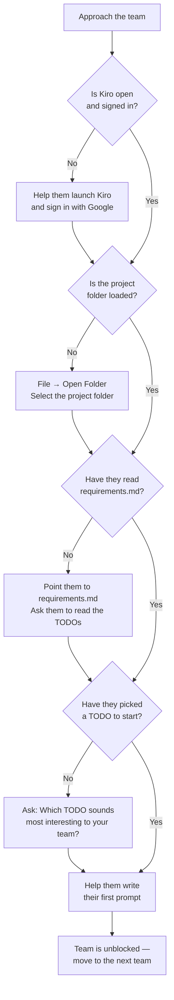

# 🧑‍🏫 Mentor Playbook

Thank you for volunteering your time. You're the reason this event works — students need a calm, encouraging presence who can unblock them when they get stuck and nudge them forward when they stall.

This guide gives you everything you need: a clear role description, a minute-by-minute playbook for the build phase, and practical tips for coaching students through their first experience with Kiro.

## 🎯 Your Role

You are a **guide on the side**, not a hands-on builder. Your job is to:

- **Unblock teams** — help them get past technical hiccups, confusing errors, or blank-screen moments.
- **Coach prompts** — students often write vague prompts. Help them be specific so Kiro gives better results.
- **Manage energy** — encourage teams that are stuck, and gently redirect teams that are going down a rabbit hole.
- **Watch the clock** — keep teams aware of time so they don't spend 35 minutes building and 5 minutes panicking about their pitch.
- **Stay hands-off** — resist the urge to type for them. Ask questions, suggest approaches, but let students drive.

:::tip The Best Mentors Ask Questions
Instead of telling a team what to do, ask: "What are you trying to build right now?" or "What did Kiro say when you tried that?" This keeps students thinking and learning, not just following instructions.
:::

## ⏱️ The 40-Minute Build Phase

The build phase is the core of the hackathon. Here's what to do at each stage.

:::note Timing
These times are approximate. Your event organiser will announce key transitions, but keeping your own eye on the clock helps you stay ahead.
:::

### 🚦 Minutes 0–5: Triage and Setup

Your first job is to make sure every team is up and running. Walk between your assigned teams and check:

- Kiro is open and signed in
- The project folder is loaded (files visible in the left panel)
- Students have read `requirements.md` and picked a TODO to start with

If a team is stuck on setup, help them get unblocked fast. If it's a device issue you can't fix in 60 seconds, flag it to the event organiser and move on — don't let one broken laptop eat your first five minutes.

### 🌱 Minutes 5–15: First Prompt and First Win

This is the most important window. Teams need to send their first prompt to Kiro and see something happen. Your goal: **every team has a working first feature by minute 15.**

- Check that teams have typed a real prompt (not just "hello" or "make an app").
- If a team is staring at a blank chat, sit with them for a minute and help them write their first prompt together.
- Once Kiro generates code, help them preview it in Chrome. Seeing their app for the first time is a huge motivator.

:::tip If a Team Is Frozen
Some teams freeze because they don't know where to start. Ask them: "Which TODO from the requirements sounds most interesting to your team?" Then help them turn that into a prompt. Getting the first thing on screen is everything.
:::

### 🔁 Minutes 15–25: Iteration Loop

By now, teams should be in a rhythm: prompt → generate → preview → repeat. Your job shifts to:

- **Roaming** — move between teams, spending 1–2 minutes with each.
- **Prompt coaching** — if a team's results look off, check their prompt. Help them be more specific.
- **Scope management** — if a team is trying to build five features at once, encourage them to finish one properly before starting the next.

:::note Halfway Check
At minute 20, do a quick mental check: has every team got at least one working feature they could demo? If not, prioritise those teams for the next five minutes.
:::

### ✨ Minutes 25–35: Polish and Stretch

Teams that are doing well will naturally start adding more features or improving what they have. Teams that are struggling may still be on their first feature — that's okay.

- Encourage strong teams to try a stretch goal from the [Prompt Library](/hackathon/prompts).
- Help struggling teams get their one feature working cleanly rather than starting something new.
- Start mentioning the pitch: "You've got about 10 minutes of building left — start thinking about what you'll show the judges."

### 🎤 Minutes 35–40: Pitch Prep

When the organiser announces "10 minutes left" (or at minute 35 if there's no announcement), it's time to stop building.

- **Tell teams to stop coding.** Seriously — they will want to keep going. Be firm but friendly.
- Help them take screenshots of their app in Chrome.
- Ask each team: "If you had 60 seconds to explain your app to someone, what would you say?"
- Make sure they know the pitch format (the organiser will explain this, but reinforce it).

:::warning The Biggest Mistake Teams Make
They keep coding until the last second and have nothing prepared for the pitch. A working app with no pitch loses to a simpler app with a clear story. Help them switch gears.
:::

## 🌳 First 5 Minutes: Triage Decision Tree

When you first reach a team, use this decision tree to figure out what they need:

:::tip Spend No More Than 2 Minutes Per Team During Triage
If a team has a hardware or login issue you can't fix quickly, flag it to the event organiser and move on. Come back to them once your other teams are rolling.
:::

## 💬 Prompt Coaching Tips

Students often write prompts that are too vague for Kiro to produce good results. Here's how to help them improve.

### The "Be Specific" Rule

When a student's prompt isn't working well, ask them three questions:

1. **What** are you building? (A form, a list, a map, a chart?)
2. **What data** does it need? (What fields, what information?)
3. **Where** does it go? (A new page, below the header, in the sidebar?)

A prompt that answers all three questions almost always gets a good result from Kiro.

### Good vs Vague Prompts

Help students see the difference:

| ❌ Vague Prompt | ✅ Specific Prompt |
|---|---|
| "Make a page about pollution" | "Add a page that shows a list of beach pollution reports with the beach name, date, and a short description" |
| "Add a map" | "Add a map to the reports page that shows a pin for each beach report using its latitude and longitude" |
| "Fix the form" | "The beach report form doesn't save the date field when I click submit — fix the date picker so it saves correctly" |
| "Make it look better" | "Change the header background to dark blue and make the page title white and larger" |

:::tip The 10-Second Test
Read the student's prompt and ask yourself: "Could I build this from just this description?" If not, help them add the missing details before they hit Enter.
:::

### When Kiro Gets It Wrong

Sometimes Kiro will generate something that doesn't match what the team wanted. Coach them to:

1. **Describe what's wrong** — "The form is there but it's missing the date field."
2. **Say what they expected** — "I wanted a date picker below the description field."
3. **Ask Kiro to fix it** — "Add a date picker field below the description in the beach report form."

Iteration is normal. The best teams aren't the ones who get it right on the first prompt — they're the ones who iterate quickly.

## 🗣️ Conversation Starters

Not sure how to approach a team? Here are some openers that work well:

**When you first arrive:**
- "Hey team — what problem did you pick?"
- "What are you building? Show me what you've got so far."
- "How's Kiro treating you? Getting good results?"

**When a team seems stuck:**
- "What were you trying to do when it stopped working?"
- "Can you show me the last prompt you sent to Kiro?"
- "What does the error message say? Let's read it together."

**When a team is doing well:**
- "Nice work — what are you adding next?"
- "Have you thought about what you'll say in your pitch?"
- "That's a solid feature. What would make it even better?"

**When it's time to wrap up:**
- "You've got 10 minutes left — time to switch to pitch mode."
- "What's the one thing you most want to show the judges?"
- "Let's take some screenshots of your app before you stop."

:::tip Match Their Energy
If a team is excited, be excited with them. If a team is frustrated, be calm and reassuring. Your tone sets the tone for their experience.
:::

## 🏆 What Judges Look For

At the end of the hackathon, each team presents their project to a panel of judges. Here's what the judges are evaluating — share this with your teams so they know what to aim for.

### 1. Problem Understanding

Does the team clearly understand the problem they chose? Can they explain who it affects and why it matters? Judges want to see that the team thought about the *why*, not just the *what*.

### 2. Working Solution

Does the app actually work? Judges will look for a live demo or screenshots showing real functionality. It doesn't need to be polished — it needs to be functional. One well-built feature beats five half-broken ones.

### 3. Use of Kiro

Did the team use Kiro effectively? Judges appreciate teams that can talk about how they used prompts to build their app — what they asked for, how they iterated, what they learned along the way.

### 4. Creativity and Impact

Is the solution creative? Does it have the potential to make a real difference? Judges love ideas that are thoughtful and specific to a real community or environment.

### 5. Presentation Quality

Can the team explain their project clearly in the time given? A good pitch has a structure: the problem, the solution, a demo, and what they'd do next. Confidence and clarity matter more than polish.

:::tip Help Teams Prepare a Simple Pitch Structure
Suggest this format: **"We built [app name] because [problem]. It works by [how it works]. Here's what it looks like [show screenshots]. If we had more time, we'd add [next feature]."** That's a winning pitch in four sentences.
:::
